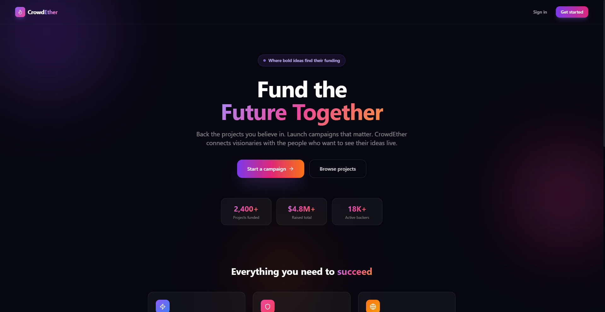
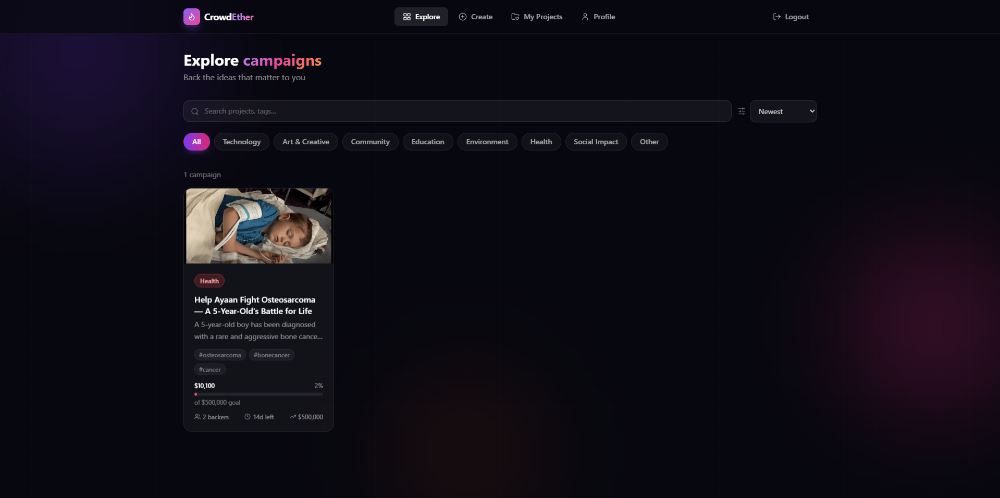
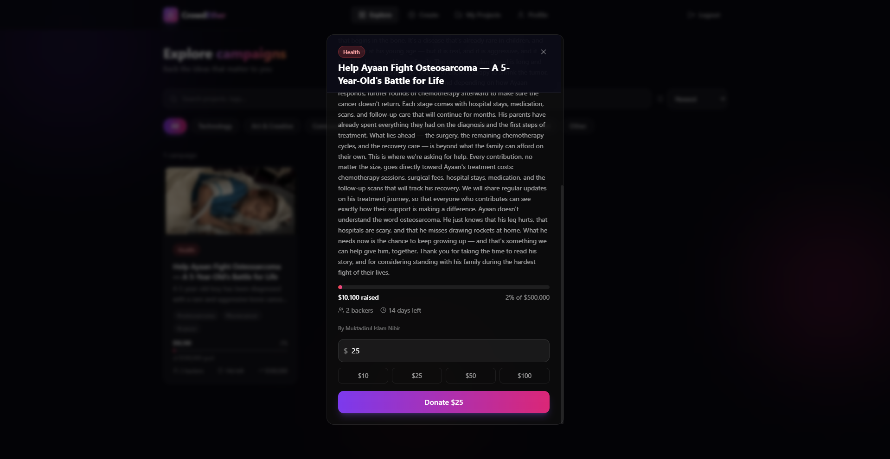
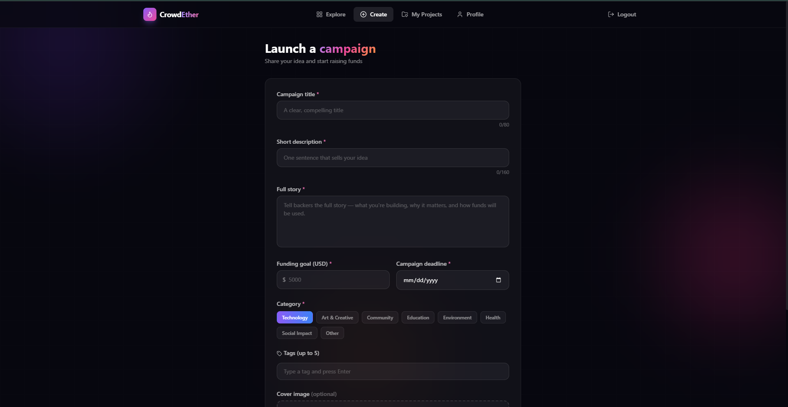

# 🔥 CrowdEther

A modern crowdfunding web application where anyone can launch campaigns, back ideas they believe in, and track funding in real time.

> Built with Next.js 14, MongoDB Atlas, Prisma ORM, Tailwind CSS, and TypeScript — fully deployable on Vercel with zero additional backend infrastructure.

---

## 📸 Screenshots

<!-- Add your screenshots here. In your GitHub repo, create a folder called `screenshots/` at the root,
     drop your images in, and replace the filenames below with your actual file names. -->






---

## ✨ Features

- **Authentication** — Secure signup and login with JWT stored in HttpOnly cookies
- **Explore campaigns** — Browse all active projects with search, category filters, and sort options (newest, most funded, ending soon, most backers)
- **Create a campaign** — Launch a campaign with a title, story, funding goal, deadline, category, tags, and a cover image upload
- **Donate** — Back any active campaign directly from the explore page with quick-amount presets
- **My Projects** — Manage your own campaigns, track funds raised, backer count, and days remaining — delete campaigns you no longer need
- **User Profile** — View your stats, edit your name and bio, and see your recent donation history
- **Image upload** — Client-side image compression and base64 storage — no external file storage service needed
- **Project status** — Campaigns automatically show as Active, Funded, or Ended based on goal and deadline
- **Fully responsive** — Works on desktop and mobile
- **Vercel-ready** — Single Next.js repo with API routes, no separate backend needed

---

## 🛠 Tech Stack

| Layer | Technology |
|---|---|
| Framework | Next.js 14 (App Router) |
| Language | TypeScript |
| Styling | Tailwind CSS + Glassmorphism |
| Animation | Framer Motion |
| Database | MongoDB Atlas |
| ORM | Prisma |
| Auth | JWT via `jose` (HttpOnly cookies) |
| Deployment | Vercel |

---

## 🚀 Running Locally

### Prerequisites

- Node.js v18 or higher
- A free [MongoDB Atlas](https://www.mongodb.com/atlas) account (M0 free tier is enough)

### 1. Clone the repository

```bash
git clone https://github.com/nibir036/CrowdEther.git
cd CrowdEther
```

### 2. Install dependencies

```bash
npm install
```

### 3. Set up environment variables

Create a `.env.local` file in the root of the project:

```env
DATABASE_URL="mongodb+srv://<username>:<password>@<cluster>.mongodb.net/crowdether?retryWrites=true&w=majority"
JWT_SECRET="your-long-random-secret-string"
```

**Getting your `DATABASE_URL`:**
1. Go to [MongoDB Atlas](https://www.mongodb.com/atlas) → create a free M0 cluster
2. Under **Database Access** → create a database user with a username and password
3. Under **Network Access** → add `0.0.0.0/0` to allow connections
4. Click **Connect** on your cluster → **Drivers** → copy the connection string
5. Replace `<password>` with your actual password and add `/crowdether` as the database name before the `?`

**Generating a `JWT_SECRET`:**
```bash
node -e "console.log(require('crypto').randomBytes(32).toString('hex'))"
```

### 4. Generate Prisma client

```bash
npx prisma generate
```

### 5. Start the development server

```bash
npm run dev
```

Open [http://localhost:3000](http://localhost:3000) in your browser.

---


## 📁 Project Structure

```
CrowdEther/
├── app/
│   ├── (auth)/             # Login and signup pages
│   ├── (main)/             # Protected pages (home, projects, myprojects, profile)
│   ├── api/                # API routes (auth, projects, donations, user)
│   ├── globals.css
│   └── layout.tsx
├── components/
│   ├── ui/                 # GlassCard primitive
│   ├── GradientBackground.tsx
│   ├── ImageUpload.tsx
│   ├── Navbar.tsx
│   └── ProjectCard.tsx
├── lib/
│   ├── auth.ts             # JWT utilities
│   ├── constants.ts        # Categories, colors, formatters
│   ├── imageUpload.ts      # Client-side image compression
│   ├── prisma.ts           # Prisma client singleton
│   └── utils.ts
├── prisma/
│   └── schema.prisma       # User, Project, Donation models
├── public/
├── middleware.ts            # Route protection
└── .env.example
```

---

## 🤝 Contributing

Pull requests are welcome. For major changes, open an issue first to discuss what you'd like to change.

---

## 📄 License

MIT

---

*Built by [Muktadirul Islam Nibir](https://github.com/nibir036)*
